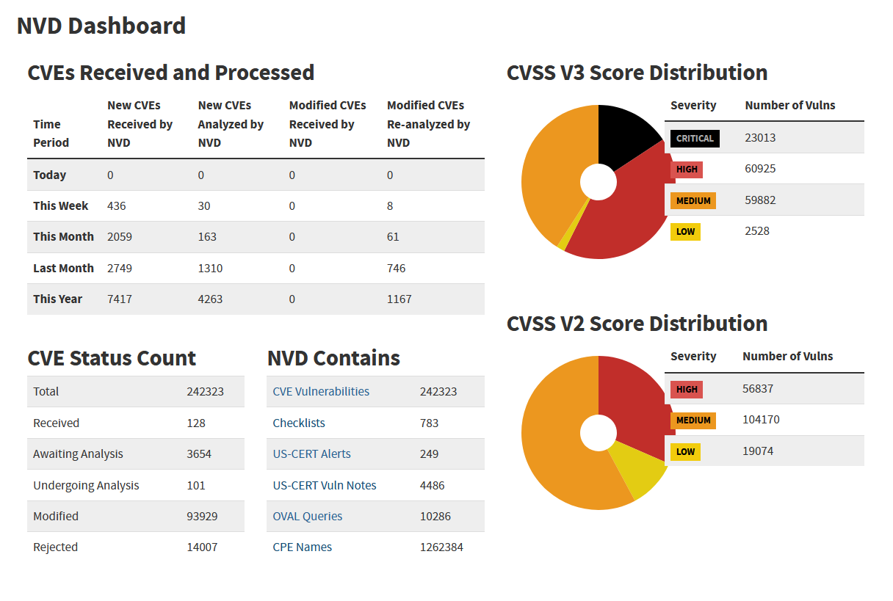

# Vulnerability Taxonomies

Objectives: Understand common vulnerbility taxonomies and how they relate.

* U.S. National Vulnerability Database ***NVD***
* Common Platform Enumeration ***CPE***
* Common Vulnerabilities and Exposures ***CVE***
* Common Vulnerability Scoring System ***CVSS***
* Common Weakness Enumeration ***CWE***
* Common Attack Pattern Enumeration and Classification ***CAPEC***
* Adversarial Tactics, Techniques & Common Knowledge ***ATT&CK***
* Open Web Application Security Project ***OWASP***

---

## National Institute of Standards and Technology (NIST)

* Founded in 1901
* Standards organization responsible for weights, measurements, and cybersecurity standards
* Also has a solid (if small) [page of memes](https://www.nist.gov/education/memes-nist)

---

## U.S. National Vulnerability Database ***NVD***

* Created by the National Institute of Standards and Technology (NIST)
* repository of standards based Vulnerability management data
* Includes multiple databases of security checklists,
  security related software flaws, misconfigurations, product names, and impact metrics.
* CVE, CVSS, and others are all a part of the NVD

[nvd.nist.gov](https://nvd.nist.gov/general)

---

## Common Platform Enumeration ***CPE***

* Basically just an official naming and versioning scheme for IT systems, software, and packages.
* Try using it on one of your projects sometime!
* Contains a dictionary of platform names and versions to automate decisions based on known vulnerabilities.

[CPE](https://csrc.nist.gov/projects/security-content-automation-protocol/specifications/cpe)

---

## What's in a name?

* Why do we need a common detailed way to name something?
* Well Formed Name == attribute pair set that can describe a number of products or identify a specific product
* WFN is a logical construct, the CPE is the specific data structure we care about

---

## CPE naming scheme in a nutshell

[From Wikipedia](https://en.wikipedia.org/wiki/Common_Platform_Enumeration)

`cpe:<cpe_version>:<part>:<vendor>:<product>:<version>:<update>:<edition>:<language>:<sw_edition>:<target_sw>:<target_hw>:<other>`

Traditionally, both a blank field or an asterisk `*` refer to a wildcard character.

Some examples:

* `cpe:2.3:o:microsoft:windows_11:-:*:*:*:*:*:*:*` Probably not specific enough for use in this class.
* `cpe:2.3:a:discord:discord:-:*:*:*:*:*:*:*` from [cpe lookup](https://nvd.nist.gov/products/cpe/detail/8F626E63-0694-43F6-8B01-2367BC7D0B71?namingFormat=2.3&orderBy=CPEURI&keyword=cpe%3A2.3%3Aa%3Adiscord&status=FINAL)
 

---

## Common Vulnerabilities and Exposures ***CVE***

* Reference method for publicly known information security vulnerabilities and exposures
* A CVE name/number/ID is a unique identifier for a a single vulnerbility
* Only CVE Numbering Authorities (CNA) can issue CVE's
  * MITRE is the primary CNA
  * There are many other public CNA's available to request a CVE
  * Various companies can assign CVE numbers for their own products 
    (Microsoft, Oracle, Red Hat, etc.)
* CVE database contains several specified fields

---

## CVE Further information and search

* [CVE Wikipedia](https://en.wikipedia.org/wiki/Common_Vulnerabilities_and_Exposures)
* [NVD CVE Lookup](https://nvd.nist.gov/vuln/search)
* [MITRE CVE Lookup](https://cve.mitre.org/cve/search_cve_list.html)

---

## Common Vulnerability Scoring System ***CVSS***

* Given the growing number of CVE's each year we need a way to focus on the most important ones
* CVSS is a means of assigning a numerical score based on the ***severity*** of a given CVE
* Scores range from 0 to 10, low being not very important and 10 being a critical security vulnerability
* Several changes to this scoring metric have occured, be sure you are comparing similar versions of CVSS scores

[CVSS Wikipedia](https://en.wikipedia.org/wiki/Common_Vulnerability_Scoring_System)

---

## Know your limits

---

## More Acronyms (YAY! or maybe OMGWTFBBQ)

* **KEV** Known Exploited Vulnerabilities, boolean value to specifiy whether a CVE is being exploited
* **EPSS** Exploit Prediction Scoring System, 0 to 1 value with a ton of input (KEV, media, social media,
   security vendor info, etc.), establishing a *likelihood of exploitation* in the next 30 days.

[EPSS model](https://www.first.org/epss/model)

---

## Common Weakness Enumeration ***CWE***

* Category system for software and hardware weaknesses and vulnerabilities 
* Over 600 categories including
  * Buffer Overflow
  * path/directory traversal errors
  * hard-coded passwords
  * insecure random numbers... etc.

[Vulnerbility cange by year](https://nvd.nist.gov/general/visualizations/vulnerability-visualizations/cwe-over-time)
[MITRE about CWE](http://cwe.mitre.org/about/index.html)
[CWE Top 25](https://cwe.mitre.org/top25/)

---

## Common Attack Pattern Enumeration and Classification ***CAPEC***

* Public catalog of common attack patterns to help users understand how weaknesses are exploited
* Based on Software Design Patterns
* Relates weaknesses (CWE) and vulnerbilities (CVE).
* Similar to CWE, the same CAPEC may apply to many CVEs
* [CAPEC-139: Relative Path Traversal](http://capec.mitre.org/data/definitions/139.html)

[Attack Patterns Wikipedia](https://en.wikipedia.org/wiki/Attack_patterns)
[CAPEC Website](http://capec.mitre.org/about/new_to_capec.html)

---

## Adversarial Tactics, Techniques & Common Knowledge ***ATT&CK***

* Knowledge base of adversarial tactics
* The more you know (or a more theatrical: know your enemy)

[MITRE ATT&CK](https://attack.mitre.org/)

---

## CAPEC & ATT&CK

Use CAPEC for:

* Application threat modeling
* Developer training and education
* Penetration testing

Use ATT&CK for:

* Comparing computer network defense capabilities
* Defending against the Advanced Persistent Threat
* Hunting for new threats
* Enhancing threat intelligence
* Adversary emulation exercises

---

## Open Web Application Security Project ***OWASP***

MITRE is just one (pretty big) organization.  There are others that attempt to classify similar things.

OWASP is a community that attempts similar classification for just web applications.

[OWASP Wikipedia](https://en.wikipedia.org/wiki/OWASP)

[OWASP.org](https://owasp.org/)

---

## Homework

Properly Formatted `Yourname.md` uploaded to pilot.  Style counts, I will be reading this in Github!.

* Read the following:
  * [2023 top 25 software CWE's](https://cwe.mitre.org/top25/archive/2023/2023_top25_list.html) 
  * [2023 top 10 CWE by KEV](https://cwe.mitre.org/top25/archive/2023/2023_kev_list.html)
  * [Semantic Versioning 2.0.0](https://semver.org/)
* Choose 1 of the top 25 that you have personally put in code you used/submitted.  Do a deep dive on  that CWE (read all about it).
* Write up (at least) three paragraphs on the CWE, how your code was vulnerable to it, and how you could have changed the code to not be vulnerable.  
  
* Be sure to include: 
  * What CWE you chose (name, CWE number, link to web, and an explanation in your own words)
  * Your Well Formed CPE name (fake but well formed!!!, unless you actually have a CPE for it), 
    explain each field you chose to use, be sure to assign a version via Semantic Versioning 2.0
  * Is it in the top 10 KEV list as well? What are your thoughts on the severity of the weakness.
  * What your personal experience is with the CWE
  * How you could have fixed it (what would you need to have done to not implement this weakness in your code)
  * List and link one actual CVE and related CPE that also fell prey to this weakness

